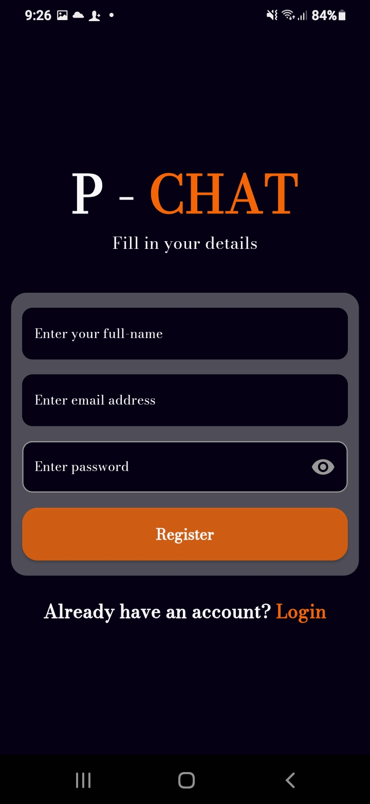

# P_CHAT

## About
P-Chat is your intelligent, AI-powered PDF assistant designed to simplify complex documents. Upload your PDFs and engage in a natural conversation with the AI to get clear, concise explanations and insights. Say goodbye to information overload and hello to effortless understanding!

## Features
* **AI-Powered Chat:** Interact with your PDFs using natural language.
* **Simplified Explanations:** Get complex information broken down into easy-to-understand summaries.
* **Intuitive Interface:** A user-friendly design for seamless navigation.

## App Screenshots

| Screen              | Screenshot                                     | Description          |
| :------------------ | :--------------------------------------------- | :------------------- |
| **Splash Screen** |  | The initial loading screen when the app starts. |
| **Login Screen** |  | Allow user to login |
| **SignUp Screen** |  | Allow user to signUp|
| **Chat Page** |  | The core AI chat interface for PDF interaction.|
| **AI response** |    | Response from AI |

## How to Clone and Run Locally

Follow these simple steps to get P-Chat up and running on your local machine.

### Prerequisites

Before you begin, ensure you have the following installed:

* **Git:** For cloning the repository.
    * [Download Git](https://git-scm.com/downloads)
* **Flutter SDK:** For running the Flutter application.
    * [Install Flutter](https://flutter.dev/docs/get-started/install)

### Step-by-Step Guide

1.  **Clone the Repository:**
    Open your terminal or command prompt and run the following command to clone the P-Chat repository:

    ```bash
    git clone [https://github.com/YOUR_USERNAME/P_CHAT.git](https://github.com/YOUR_USERNAME/P_CHAT.git)
 

2.  **Navigate to the Project Directory:**
    Change your current directory to the cloned project folder:

    ```bash
    cd P_CHAT
    ```

3.  **Install Dependencies:**
    Fetch all the necessary Flutter packages required for the project:

    ```bash
    flutter pub get
    ```

4.  **Run the Application:**
    Connect a device (physical or emulator) or run it on a web browser or desktop, then execute the following command:

    ```bash
    flutter run
    ```

    This command will build and launch the P-Chat application.

That's it! You should now have P-Chat running on your local machine.
